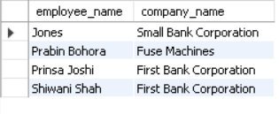

## Tutorial-1
---
**SQL schema definition for the employee database is as:**

>employee(employee-name, street, city)
works(employee-name, company-name, salary)
company(company-name, city)
manages (employee-name, manager-name)

#### 1. Give an SQL schema definition for the employee database. Choose an appropriate primary key for each relation schema, and insert any other integrity constraints (for example, foreign keys) you find necessary.

 The following Queries are used to create the required database.
* To create and select the company database:
 
    ```sql
    CREATE DATABASE db_Company;
    USE db_Company;
    ```
* To create employee table:
    ```sql
    CREATE TABLE tbl_employee (
    employee_name VARCHAR(64) NOT NULL PRIMARY KEY,
    street VARCHAR(32),
    city VARCHAR(32)
    );
    ```
* To create company table:
    ```sql
    CREATE TABLE Tbl_Company (
    company_name VARCHAR(64) NOT NULL PRIMARY KEY,
    city VARCHAR(32)
    );
    ```
* To create works table:
    ```sql
    CREATE TABLE Tbl_works (
    employee_name VARCHAR(64) NOT NULL PRIMARY KEY,
    company_name VARCHAR(64),
    salary FLOAT,
    FOREIGN KEY (employee_name)
        REFERENCES Tbl_employee (employee_name),
    FOREIGN KEY (company_name)
        REFERENCES Tbl_Company (company_name)
    ); 
    ```
* To create table manages:
    ```sql
    CREATE TABLE Tbl_manages (
    employee_name VARCHAR(64) NOT NULL PRIMARY KEY,
    manager_name VARCHAR(64) NOT NULL,
    FOREIGN KEY (employee_name)
        REFERENCES Tbl_employee (employee_name)
    );
    ```
**Let's insert some data into the tables:**

* Insert some data into Employee Table
    ```sql
    INSERT INTO Tbl_employee(employee_name, street, city)
    VALUES ('Alice','Old Street','Old Town'),
        ('Raj Kumar Dhakal','Chandor Chowk','Lalitpur'),
        ('Ujjwal Poudel', 'Maitighar', 'Kathmandu'),
        ('Rishav Subedi', 'Maitighar', 'Kathmandu'),
        ('Santosh Pandey', 'Char Do bato', 'Bhaktapur'),
        ('Prabin Bohora', 'Chandol Chowk', 'Lalitpur'),
        ('Shiwani Shah','Budhhanagar','Kathmandu'),
        ('Prinsa Joshi','Suryabinayak','Bhaktapur'),
        ('Hellington Javier', 'Aster Avenue', 'Bellington'),
        ('Einstein Karki', 'New chowk', 'New town'),
        ('Newton Neupane', 'Old chowk', 'Old Town'),
        ('Jones','Old Street','Old Town');
    ```
    *  View data in employee table      
        ```sql       
        SELECT 
            *
        FROM
            tbl_employee;
        ```
        <br>
        *Fig: Employee Table*

* Insert Data in Company table:
    ```sql
    INSERT INTO Tbl_Company(company_name, city)
    VALUES ('Bhoos Games', 'Lalitpur'),
            ('Fuse Machines', 'Bhaktapur'),
            ('F1Soft IT Solution', 'Kathmandu'),
            ('MSI Corporated','Kathmandu'),
            ('First Bank Corporation','Bhaktapur'),
            ('Small Bank Corporation','Bhaktapur');
    ```
            
    * View data from company table
        ```sql    
        SELECT 
            *
        FROM
            tbl_company;
        ```
        <br>
        *Fig: Company Table*

* Insert Data into Work Table
    ```sql
    INSERT INTO tbl_Works(employee_name, company_name, salary)
    VALUES ('Raj Kumar Dhakal', 'Fuse Machines', 55000),
        ('Ujjwal Poudel', 'MSI Corporated', 65000),
        ('Prabin Bohora', 'Fuse Machines', 69000),
        ('Santosh Pandey', 'F1Soft IT Solution', 85000),
        ('Rishav Subedi', 'Bhoos Games', 60000),
        ('Shiwani Shah','First Bank Corporation',75000),
        ('Prinsa Joshi','First Bank Corporation',95000),
        ('Jones','Small Bank Corporation',15000),
        ('Alice','Small Bank Corporation',10000),
        ('Hellington Javier', 'First Bank Corporation', 25000),
        ('Einstein Karki', 'First Bank Corporation', 56000),
        ('Newton Neupane', 'First Bank Corporation', 47256);
    ```
    * View data from Works table
        ```sql
        SELECT 
            *
        FROM
            tbl_works;
        ```
        <br>
        *Fig: Works Table*

* Insert data into manages table
    ```sql
    INSERT INTO Tbl_manages(employee_name, manager_name)
    VALUES ('Hellington Javier', 'Newton Neupane'),
        ('Einstein Karki', 'Newton Neupane'),
        ('Rishav Subedi', 'Ujjwal Poudel'),
        ('Shiwani Shah', 'Prinsa Joshi'),
        ('Alice', 'Jones'),
        ('Raj Kumar Dhakal', 'Prabin Bohora');
    ```

    * View data from Manages table
        ```sql
        SELECT 
            *
        FROM
            tbl_manages;
        ```
        <br>
        *Fig: Manages Table*
#### 2. Consider the employee database of Figure 5, where the primary keys are underlined. Give an expression in SQL for each of the following queries:

##### 2.a) Find the names of all employees who work for First Bank Corporation.   
* Query:
    ```sql
        SELECT 
        employee_name
        FROM
            tbl_works
        WHERE
            company_name = 'First Bank Corporation';
    ```
* Output:<br>
    <br>

##### 2.b) Find the names and cities of residence of all employees who work for First Bank Corporation.

* Using sub query:
    ```sql
    SELECT 
    tbl_employee.employee_name, tbl_employee.city
    FROM
        tbl_employee
    WHERE
        tbl_employee.employee_name = ANY (SELECT DISTINCT
                tbl_works.employee_name
            FROM
                tbl_works
            WHERE
                tbl_works.company_name = 'First Bank Corporation');
    ```
    *Here, the sub query gives the returns the names of employees working in **First Bank Corporation** from **works** table and the name and city of those employees is shown from **employee** table.*
    <br>

* Using Join:
    ```sql
    SELECT 
        tbl_employee.employee_name, tbl_employee.city
    FROM
        tbl_employee
            INNER JOIN
        tbl_works ON tbl_employee.employee_name = tbl_works.employee_name
    WHERE
        tbl_works.company_name = 'First Bank Corporation';
    ```
    *Here, the **employee** table is joined with **works** table using **employee_name** as the common column and name and city of the employee working in **First Bank Corporation** is taken from the joined table.*
    <br>

* Output:<br>
    <br>

##### 2.c) Find the names, street addresses, and cities of residence of all employees who work for First Bank Corporation and earn more than $10,000.

* Using sub query:
    ```sql
    SELECT 
        tbl_employee.employee_name,
        tbl_employee.street,
        tbl_employee.city
    FROM
        tbl_employee
    WHERE
        tbl_employee.employee_name = ANY (SELECT 
                tbl_works.employee_name
            FROM
                tbl_works
            WHERE
                tbl_works.company_name = 'First Bank Corporation'
                    AND tbl_works.salary > 10000);
    ```
    *Here, the sub query returns the names of employees working in **First Bank Corporation** and having **salary > 10000** from **works** table and the name and city of those employees is shown from **employee** table.*  
    <br>

* Using Join:
    ```sql
    SELECT 
        tbl_employee.employee_name,
        tbl_employee.street,
        tbl_employee.city
    FROM
        tbl_employee
            INNER JOIN
        tbl_works ON tbl_employee.employee_name = tbl_works.employee_name
    WHERE
        tbl_works.company_name = 'First Bank Corporation'
            AND tbl_works.salary > 10000;
    ```
    *Here, the **employee** table is joined with **works** table using **employee_name** as the common column and name and city of the employee working in **First Bank Corporation** and having **salary > 10000** is taken from the joined table.*
    <br>

* Output:<br>
    <br>

##### 2.d) Find all employees in the database who live in the same cities as the companies for which they work.

* Using sub query:
    ```sql
    SELECT 
        tbl_employee.employee_name, Tbl_employee.city
    FROM
        tbl_employee
    WHERE
        tbl_employee.city = (SELECT 
                tbl_Company.city
            FROM
                tbl_Company
            WHERE
                tbl_Company.company_name = (SELECT 
                        tbl_Works.company_name
                    FROM
                        tbl_Works
                    WHERE
                        tbl_works.employee_name = tbl_employee.employee_name));
    ```
    *Here, the first sub-query returns the **company names** of every employees using **works** and **employee** table and second sub-query returns the **city** of the companies of employees from first sub-query which is compared with the city of employee and **name** and **city** of the employee who live in same city as the companies they work are returned.*
    <br>
* Using Join:
    ```sql
    SELECT 
        tbl_employee.employee_name, Tbl_employee.city
    FROM
        tbl_employee
            INNER JOIN
        tbl_works ON tbl_employee.employee_name = tbl_works.employee_name
            INNER JOIN
        tbl_company ON tbl_works.company_name = tbl_company.company_name
    WHERE
        tbl_company.city = tbl_employee.city;
    ```
    *Here, the **employee** table is joined with **works** table using **employee_name** as the common column and again **company** table is joined with the joint table using **company_name** as common column then the **name** and **city** of employee which have same city as the company they work in are returned.*
    <br>
* Output:<br>
    <br>


##### 2.e) Find all employees in the database who live in the same cities and on the same streets as do their managers.
* Using sub query:
    ```sql
    SELECT 
        Tbl_manages.employee_name AS employee,
        Tbl_manages.manager_name AS manager
    FROM
        Tbl_manages
    WHERE
        (SELECT 
                tbl_employee.city
            FROM
                Tbl_employee
            WHERE
                Tbl_employee.employee_name = Tbl_manages.manager_name) = (SELECT 
                tbl_employee.city
            FROM
                Tbl_employee
            WHERE
                Tbl_employee.employee_name = Tbl_manages.employee_name)
            AND (SELECT 
                tbl_employee.street
            FROM
                Tbl_employee
            WHERE
                Tbl_employee.employee_name = Tbl_manages.manager_name) = (SELECT 
                tbl_employee.street
            FROM
                Tbl_employee
            WHERE
                Tbl_employee.employee_name = Tbl_manages.employee_name); 
    ```
    *Here,
    `SELECT tbl_employee.street FROM Tbl_employee WHERE Tbl_employee.employee_name = Tbl_manages.employee_name)`gives the **street** of the employee in **manages** table. And`SELECT tbl_employee.street FROM Tbl_employee WHERE Tbl_employee.employee_name = Tbl_manages.manager_name` gives the **street** of the manager in **manages** table which are compared with eachother. Similarly, the other two sub query give the **city** of employee and manager in the **manages** table using **employee** table which are also compared. Finally, those employee who live in the same city and street as their manager are returned.*
    <br>

* Using Join:
    ```sql
    SELECT 
        Tbl_manages.employee_name AS employee,
        Tbl_manages.manager_name AS manager
    FROM
        Tbl_manages
            INNER JOIN
        tbl_employee AS emp ON Tbl_manages.employee_name = emp.employee_name
            INNER JOIN
        tbl_employee AS manager ON Tbl_manages.manager_name = manager.employee_name
    WHERE
        emp.city = manager.city
            AND emp.street = manager.street;
    ```
    *Here, the **manages** table is joined with **employee** table twice. Once, on `Tbl_manages.employee_name = emp.employee_name` with alias **emp** and other on `Tbl_manages.manager_name = manager.employee_name` with alias **manager** for employee and manager respectively. Then the **city** and **street** of the joined table **emp** and **manager** are compared and the entries which have same values are returned.*
    <br>
* Output:<br>
    <br>

##### 2.f) Find all employees in the database who do not work for First Bank Corporation.
* Query:
    ```sql
    SELECT 
        tbl_works.employee_name
    FROM
        tbl_works
    WHERE
        tbl_works.company_name != 'First Bank Corporation';
    ```
* Output:<br>
    <br>

##### 2.h) Assume that the companies may be located in several cities. Find all companies located in every city in which Small Bank Corporation is located.
* Query:
    ```sql
    SELECT 
        *
    FROM
        tbl_company
    WHERE
        tbl_company.city = (SELECT 
                tbl_company.city
            FROM
                tbl_company
            WHERE
                tbl_company.company_name = 'Small Bank Corporation');
    ```
    *Here, sub query returns the city of the company **Small Bank Corporation** then, we check for the company on same city as that and the matching entries are returned.*
    <br>
* Output:<br>
<br>

##### 2.i) Find all employees who earn more than the average salary of all employees of their company.
* Query:
    ```sql
    SELECT 
        tbl_works.employee_name, tbl_works.company_name
    FROM
        (SELECT 
            company_name, AVG(salary) AS average_salary
        FROM
            tbl_works
        GROUP BY company_name) AS avg_salary
            JOIN
        tbl_works ON avg_salary.company_name = tbl_works.company_name
    WHERE
        tbl_works.salary > avg_salary.average_salary;
    ```
    *Here, we have created a **derived table** containing **company name** and **average salary** with alias of table as **avg_salary** and joined it with **works** table on `avg_salary.company_name = tbl_works.company_name` then the entries having more **salary** then **average salary** of their company were returned from the joint table.*
    <br>

* Output:<br>
      <br>  

##### 2.j) Find the company that has the most employees.
* Query:
    ```sql
    SELECT 
        company_name, employee_count
    FROM
        (SELECT 
            company_name, COUNT(employee_name) AS employee_count
        FROM
            tbl_works
        GROUP BY company_name) as C1
    ORDER BY employee_count DESC
    LIMIT 1;
    ```
    *Here, a **derived table** with **company name** and **count of employee** is created from **work** table and **sorted in descending order** of employee count i.e. company with maximum employee at the begining. Then the first entry is returned which is the company with most employees.*
    <br>
* Output:<br>
    <br>

##### 2.k) Find the company that has the smallest payroll.
* Query:
    ```sql
    SELECT 
        company_name, payroll
    FROM
        (SELECT 
            company_name, SUM(salary) AS payroll
        FROM
            tbl_works
        GROUP BY company_name) AS total_payroll
    ORDER BY payroll ASC
    LIMIT 1;
    ```
    *This is similar to 2.j but instead of **employee count** we created derived table with **total payroll(salary)** and arranged in ascending order then, returned the first entry.*
    <br>
* Output:<br>
    <br>

##### 2.l) Find those companies whose employees earn a higher salary, on average, than the average salary at First Bank Corporation.
* Query:
    ```sql
    SELECT 
        company_name,average_salary
    FROM
        (SELECT 
            company_name, AVG(salary) AS average_salary
        FROM
            tbl_works
        GROUP BY company_name) AS avg_salary
    WHERE
        avg_salary.average_salary > (SELECT 
                avgs
            FROM
                (SELECT 
                    company_name, AVG(salary) AS avgs
                FROM
                    tbl_works
                GROUP BY company_name) AS avgs_salary
            WHERE
                avgs_salary.company_name = 'First Bank Corporation');
    ```
    *Here we create a derived table with **company name** and **average salary** which we used to get the average salary of **First Bank Corporation** and compare it with **average salary** of other companies and the entries with more average salary than First Bank Corporation were returned.*
    >*Here the same sub query is used twice because mysql doesn't allow the use of alias of derived table inside another select sub query.*
* Output:<br>
    <br>

<br>
#### 3. Consider the relational database of Figure 5. Give an expression in SQL for each of the following queries:
##### 3.a) Modify the database so that Jones now lives in Newtown.
* Query:
    ```sql
    UPDATE tbl_employee 
    SET 
        city = 'Newtown',
        street = 'New Street'
    WHERE
        employee_name = 'Jones';
    ```
    * Check if the query worked or not by selecting data from employee table:
        ```sql
        SELECT 
            *
        FROM
            tbl_employee
        WHERE
            employee_name = 'Jones';
        ```
    * Output:<br>
        

##### 3.b) Give all employees of First Bank Corporation a 10 percent raise
* Query:
    ```sql
    UPDATE tbl_works 
    SET 
        salary = salary * 1.1
    WHERE
        company_name = 'First Bank Corporation';
    ```
    * Check if the query worked or not by selecting data from works table
        ```sql
        SELECT 
            *
        FROM
            tbl_works
        WHERE
            company_name = 'First Bank Corporation';
        ```
    * Output:<br>
        *Before raise:*<br>
        <br>

        *After raise:*<br>
        <br>
        >we've only selected the updated entries to show.
##### 3.c) Give all managers of First Bank Corporation a 10 percent raise.
* Using sub query:
    ```sql
    UPDATE tbl_works 
    SET 
        salary = salary * 1.1
    WHERE
        employee_name = ANY (SELECT DISTINCT
                manager_name
            FROM
                tbl_manages)
            AND company_name = 'First Bank Corporation';
    ```
    *Sub query gives the name of employees working in **First Bank Corporation** who are **managers** and the raise of 10% is given to those employees.*
    <br>
* Using Join:
    ```sql
    UPDATE tbl_works
            INNER JOIN
        tbl_manages ON tbl_manages.manager_name = tbl_works.employee_name 
    SET 
        salary = salary * 1.1
    WHERE
        tbl_works.company_name = 'First Bank Corporation';
    ```
    *Here the table **works** is joined with table **manages** on `tbl_manages.manager_name = tbl_works.employee_name` which gives the managers then we give raise of 10% to the employee working in First Bank Corporation.*

    * Check if the query worked or not by selecting data from works table:"
    ```sql
    SELECT 
        *
    FROM
        tbl_works
    WHERE
        company_name = 'First Bank Corporation';
    ```
    * Output:<br>
    *Before raise for managers:*<br>
    <br>
    *After raise for managers:*<br>
    <br>


##### 3.d) Give all managers of First Bank Corporation a 10 percent raise unless the salary becomes greater than $100,000; in such cases, give only a 3 percent raise
* Using sub query:
    ```sql
    UPDATE tbl_works 
    SET 
        salary = IF(salary < 100000,
            salary * 1.1,
            salary * 1.03)
    WHERE
        employee_name = ANY (SELECT DISTINCT
                manager_name
            FROM
                tbl_manages)
            AND company_name = 'First Bank Corporation';
    ```
    *Here, sub query selects the employee of First Bank Corporation who are managers and given raise of 10 percent unless the salary becomes greater than $100,000; in such cases, only a 3 percent raise is given*
    <br>

* Using Json:
    ```sql
    UPDATE tbl_works
            INNER JOIN
        tbl_manages ON tbl_manages.manager_name = tbl_works.employee_name 
    SET 
        salary = IF(salary < 100000,
            salary * 1.1,
            salary * 1.03)
    WHERE
        tbl_works.company_name = 'First Bank Corporation';
    ```
    *The work table is joined with manages table on `bl_manages.manager_name = tbl_works.employee_name` and given raise of 10 percent unless the salary becomes greater than $100,000; in such cases, only a 3 percent raise is given*

    * check if the query worked or not by selecting data from works table this query only checks data for the employee of first bank corporation who are managers*
    ```sql
    SELECT 
        *
    FROM
        tbl_works
    WHERE
        company_name = 'First Bank Corporation'
            AND employee_name = ANY (SELECT DISTINCT
                manager_name
            FROM
                tbl_manages);
    ```
    * Output:<br>
    <br>
##### 3.e) Delete all tuples in the works relation for employees of Small Bank Corporation.
* Query:
    * Before deleting data from table with relation we should disable foreign key check.
        ```sql
        SET foreign_key_checks = 0;
        ```
    * Run the delete query.
        ```sql
        DELETE tbl_works , tbl_employee , tbl_manages FROM tbl_works
                JOIN
            tbl_employee ON tbl_employee.employee_name = tbl_works.employee_name
                LEFT JOIN
            tbl_manages ON tbl_works.employee_name = tbl_manages.employee_name 
        WHERE
            tbl_works.company_name = 'Small Bank Corporation';
        ```
        *To **delete the data from all the tables** we first join all the tables and delete on the given **condition.***
    * Enable the foreign key check after deletion.
        ```sql
        SET foreign_key_checks = 1;
        ```
* Check if the data was deleted or not:
    * Query:
        ```sql
        SELECT 
            tbl_works.employee_name,
            tbl_works.company_name,
            tbl_works.salary,
            tbl_employee.street,
            tbl_employee.city,
            tbl_manages.manager_name
        FROM
            tbl_works
                INNER JOIN
            tbl_employee ON tbl_employee.employee_name = tbl_works.employee_name
                LEFT JOIN
            tbl_manages ON tbl_works.employee_name = tbl_manages.employee_name;
        ```
        *We are joining the **works**, **employee** and **manages** table so that we can see if the data has been delete from all three or not.* 
        <br>
    * Output:<br>
        <br>
        *We can see that the employee of **Small Bank Corporation** have been removed.*
